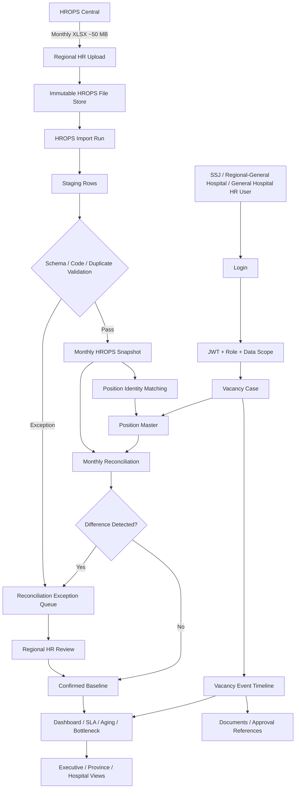
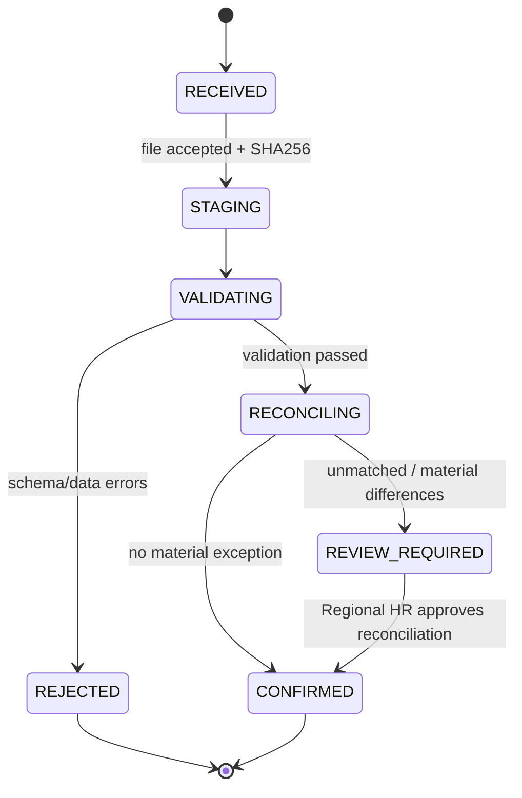
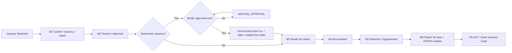
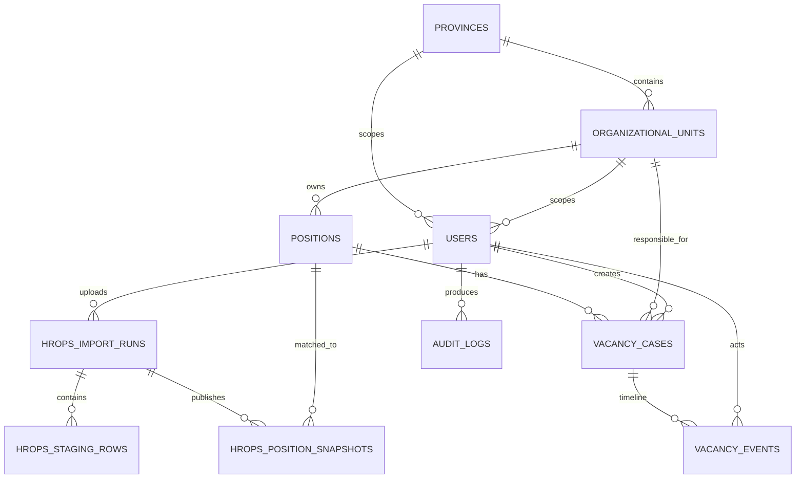
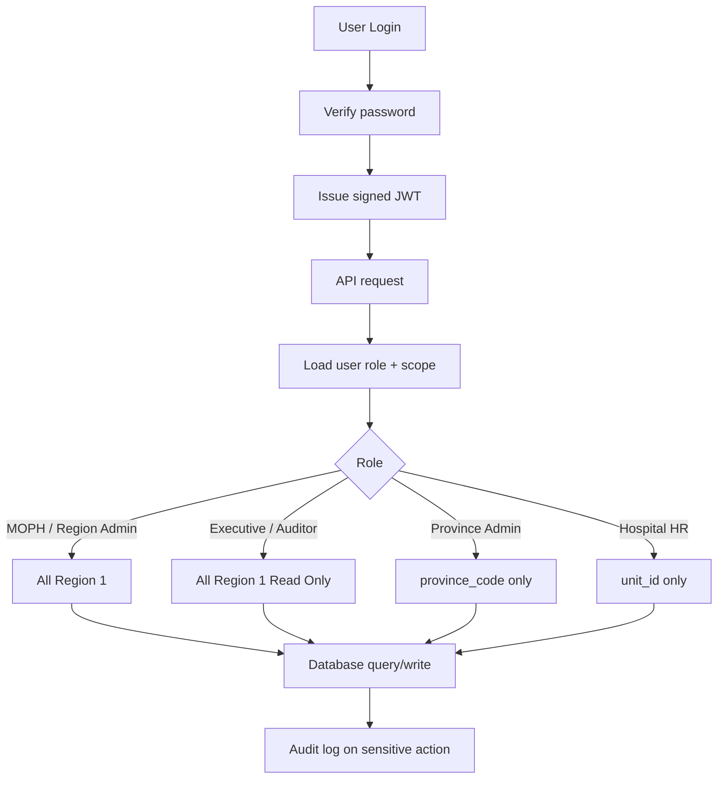
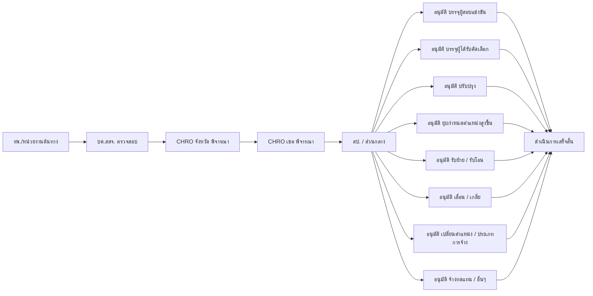

# CHRO HR1 — Data Flow, Database and User Governance

เอกสารนี้กำหนด **source of truth**, การเกิดข้อมูล, monthly reconciliation, RBAC และ audit trail สำหรับระบบ CHRO HR1

## 1. Data sources

ระบบรับข้อมูลหลัก 2 ชุด และไม่ให้ชุดใดเขียนทับอีกชุดโดยตรง

1. **HROPS Monthly Baseline** — ไฟล์ `.xlsx` ประมาณ 50 MB นำเข้าเดือนละครั้ง โดยงานบริหารทรัพยากรบุคคลของสำนักงานเขตสุขภาพ
2. **Operational Vacancy Data** — ข้อมูล workflow ที่ สสจ. / รพศ. / รพท. บันทึกระหว่างการบริหารตำแหน่งว่างแต่ละตำแหน่ง

## 2. End-to-end data flow

### Core rule

- HROPS = **authoritative monthly baseline**
- Area-entered data = **authoritative operational workflow history**
- `Position Master` = stable identity of a position
- `Vacancy Case` = one vacancy episode; the same position can have multiple cases over time
- `Vacancy Event` = immutable timeline of actions/status changes
- Monthly import creates a **new snapshot**; it never destroys the prior month

## 3. HROPS import state

The uploaded original file is retained as immutable evidence with filename, baseline month, SHA-256, size, uploader and timestamp.

## 4. Vacancy workflow

For retirement vacancies, the approval check is a workflow gate rather than a cosmetic checkbox. The event must retain the approval document reference and effective date.

## 5. Database relationship

## 6. User roles and data scope

| Role | Scope | HROPS import | Operational write | Audit | Typical user |
|---|---|---:|---:|---:|---|
| `MOPH_ADMIN` | Region-wide | Yes | Yes | Yes | Central/system administrator |
| `REGION_ADMIN` | Region-wide | Yes | Yes | Yes | Regional HR / CHRO admin |
| `REGION_EXECUTIVE` | Region-wide | No | No | No | CHRO executive |
| `PROVINCE_ADMIN` | Own province | No | Yes | No | สสจ. |
| `HOSPITAL_HR` | Own organization | No | Yes | No | รพศ. / รพท. / permitted hospital |
| `AUDITOR` | Region-wide | No | No | Yes | Audit / governance reviewer |

### Scope enforcement

A UI filter is **not** a security boundary. Scope is enforced again inside the API before each write.

## 7. Reconciliation rules

Recommended comparison keys in order:

1. stable `CHRO Position ID`
2. HROPS position number
3. organizational unit code + position attributes where an explicit mapping is approved

Monthly comparison should identify:

- newly created position
- filled → vacant
- vacant → filled
- position type/name/level change
- organizational-unit change
- HROPS record disappeared
- local vacancy closed but HROPS still vacant
- local vacancy active but HROPS shows filled
- unmatched HROPS row

No mismatch should silently modify a historical `Vacancy Case`.

## 8. Hierarchical process status per position

Every active vacancy case has two separate workflow dimensions:

- `current_milestone` = lifecycle milestone (M1–M6)
- `process_level + process_status` = where the case is currently being considered and what decision/action is pending

### Process-level write permissions

| User role | จังหวัด | เขต | สป. | เสร็จสิ้น |
|---|---:|---:|---:|---:|
| `HOSPITAL_HR` | Yes | No | No | No |
| `PROVINCE_ADMIN` | Yes | Yes (ส่งต่อ/ระบุว่าถึงเขต) | No | No |
| `REGION_ADMIN` | Yes | Yes | Yes | Yes |
| `MOPH_ADMIN` | Yes | Yes | Yes | Yes |
| Executive / Auditor | Read only | Read only | Read only | Read only |

For transfer/accept-transfer statuses, `process_detail` stores the person/reference detail requested by the operational workflow. Every change is also written to the vacancy event/audit trail.

## 9. Audit minimum

Record at least:

- successful / failed login
- user creation and role/scope change
- HROPS upload/import/confirmation
- vacancy creation
- every workflow/status change
- retirement-use approval
- administrative changes

Audit rows are append-only application records. Production database access should additionally be logged at infrastructure level.
