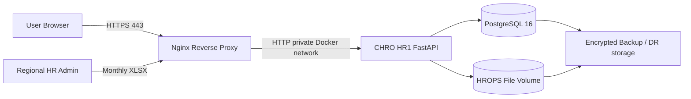

# CHRO HR1 — Ministry Server Deployment Guide

This deployment profile is intended for a Ministry / Health Region controlled Linux server or VM.

## Target architecture



## Security baseline

- Linux LTS host, patched and monitored
- inbound only `443/tcp` from approved networks; `22/tcp` restricted to administrator/VPN network
- PostgreSQL is not published to the host network
- application uses a unique database password
- `JWT_SECRET` is at least 32 random characters and stored only in server environment/secrets
- TLS certificate is issued by the Ministry/approved CA
- reverse proxy adds HSTS, `X-Content-Type-Options`, `X-Frame-Options` and request-size limit
- database and HROPS file volume are backed up on a defined schedule
- no production password or secret is committed to GitHub
- create named user accounts; do not share administrator credentials

## 1. Server prerequisites

```bash
sudo apt update
sudo apt install -y docker.io docker-compose-plugin git
sudo systemctl enable --now docker
```

```bash
sudo mkdir -p /opt/chro-hr1
sudo chown "$USER":"$USER" /opt/chro-hr1
git clone https://github.com/kongsak4807017/PositionManagement.git /opt/chro-hr1/app
cd /opt/chro-hr1/app
```

## 2. Configure environment

```bash
cp .env.example .env
chmod 600 .env
openssl rand -hex 32      # POSTGRES_PASSWORD
openssl rand -base64 48   # JWT_SECRET
```

Set at minimum `POSTGRES_PASSWORD`, `JWT_SECRET`, `PUBLIC_HOSTNAME` and `ALLOWED_ORIGINS`.

## 3. TLS

Place approved certificate material on the server:

```text
/opt/chro-hr1/tls/fullchain.pem
/opt/chro-hr1/tls/privkey.pem
```

## 4. Start the stack

```bash
docker compose -f deploy/docker-compose.prod.yml --env-file .env up -d --build
docker compose -f deploy/docker-compose.prod.yml ps
```

Health check:

```bash
curl -k https://YOUR_HOSTNAME/healthz
```

## 5. Bootstrap Region 1 reference data

```bash
docker compose -f deploy/docker-compose.prod.yml --env-file .env \
  exec app python production.py init-reference
```

## 6. Create the first administrator

```bash
docker compose -f deploy/docker-compose.prod.yml --env-file .env \
  exec app python production.py bootstrap-admin \
  --username region-admin \
  --password 'REPLACE-WITH-STRONG-PASSWORD' \
  --full-name 'Regional HR Administrator' \
  --role REGION_ADMIN
```

Then sign in and create named users with province or hospital scope. Do not keep shared accounts.

## 7. HROPS file storage

The production compose mounts a persistent volume to `/data/hrops`.

Each upload stores baseline month, original filename, SHA-256, file size, uploader, timestamp, immutable file path and import status.

The current foundation registers and preserves the monthly source file. Field mapping/reconciliation rules must be configured against the actual approved HROPS column dictionary before automatic baseline publication.

## 8. Backup

```bash
mkdir -p /opt/chro-hr1/backup
docker compose -f deploy/docker-compose.prod.yml --env-file .env \
  exec -T db pg_dump -U "$POSTGRES_USER" "$POSTGRES_DB" \
  > "/opt/chro-hr1/backup/chro_hr1_$(date +%F_%H%M).sql"
```

Also back up the HROPS persistent volume and test restore procedures.

## 9. Upgrade

```bash
cd /opt/chro-hr1/app
git fetch origin
git checkout main
git pull --ff-only
docker compose -f deploy/docker-compose.prod.yml --env-file .env up -d --build
```

Take a database backup before schema-changing releases.

## 10. Production readiness gates before real personnel data

Confirm approved data classification/system owner, network zone, TLS, backup/restore, named accounts, role matrix, password/SSO policy, audit retention, HROPS field dictionary, vulnerability scan, log monitoring and retention/deletion policy.

The repository is a deployable application foundation; formal Ministry security review and local infrastructure approval remain deployment gates.
